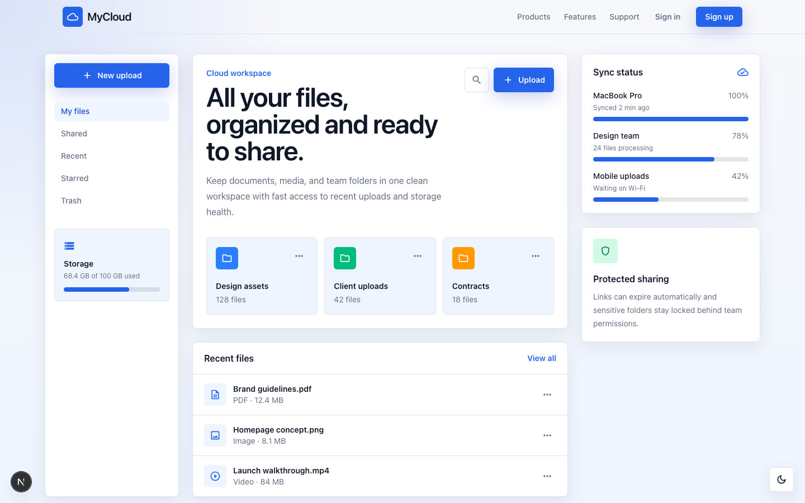
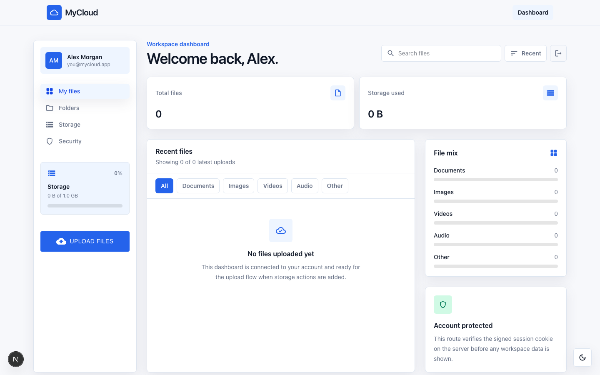
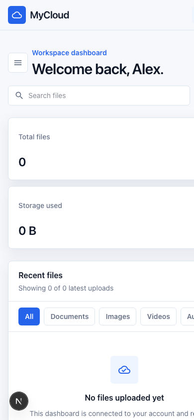
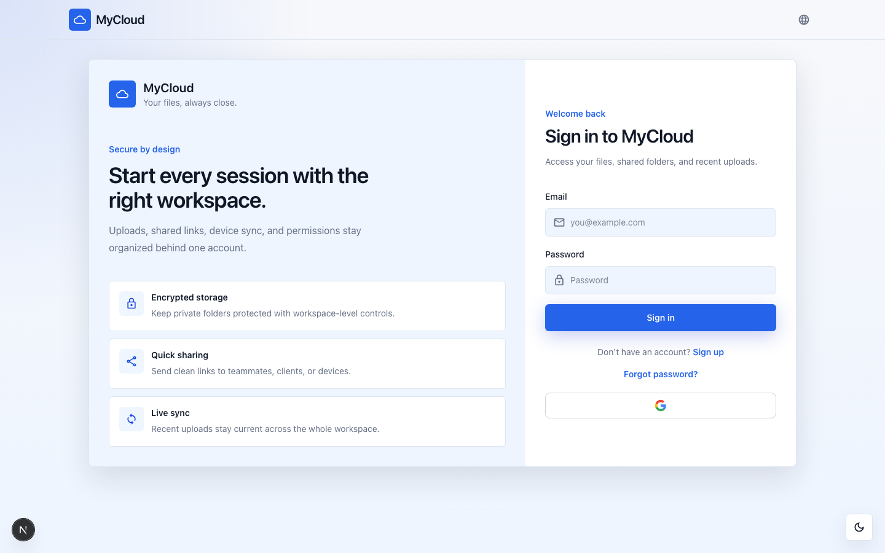
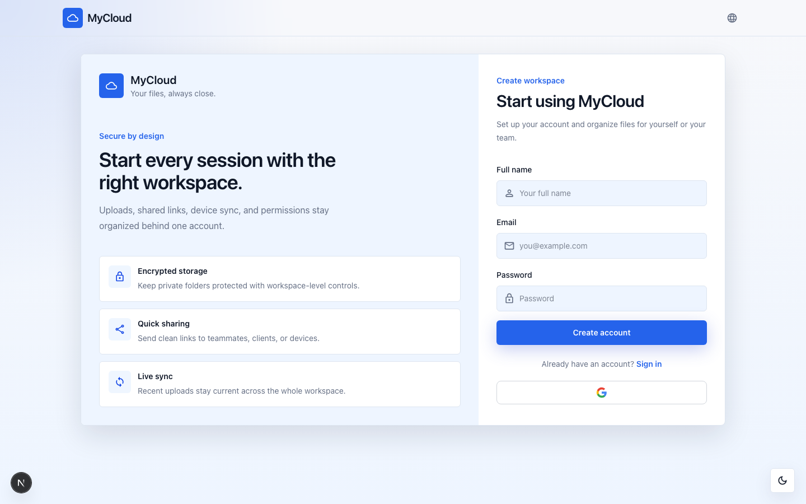
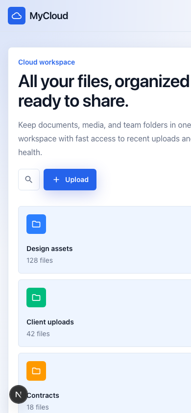

# myCloud

A self-hosted cloud storage workspace — sign in, upload, organize, and share files from a single dashboard.



---

## Features

- **Email + password auth** with email-link verification and a recover-password flow
- **Sign in with Google**
- **Folders, recent files, and a unified "My files" view** with type filters (Documents, Images, Videos, Audio, Other)
- **Search** across file names, extensions, and types, plus sort by recent / name / size
- **Storage meter** with a 1 GB per-account cap and live usage stats
- **Per-file actions**: download, share via email (Resend), toggle protection, delete
- **Responsive UI** — the dashboard sidebar collapses into a left-side drawer on mobile, preserving full feature parity
- **Light / dark theme** with system preference detection

---

## Screenshots

### Dashboard (desktop)



The sidebar on the left shows the user, primary navigation tabs, live storage usage, and the upload button. The main area surfaces total files, storage used, recent uploads with type filters, and a file-mix breakdown.

### Dashboard (mobile)



On narrow viewports, the sidebar moves behind a hamburger button. Tapping it opens a left-side drawer that mirrors the desktop sidebar (user info, tabs, storage, upload).

### Sign in



A split layout with the product pitch on the left and the email / password form (plus Google sign-in) on the right.

### Sign up



Email and password registration, followed by an email verification step.

### Landing



A mobile rendering of the public landing page that introduces the product.

---

## Tech stack

| Layer        | Choice                                                         |
| ------------ | -------------------------------------------------------------- |
| Framework    | **Next.js 16** (App Router, Turbopack, Server Actions)         |
| Language     | TypeScript + React 19                                          |
| Styling      | Tailwind CSS v4 + MUI v9 (Emotion)                             |
| Auth         | Firebase Authentication (client SDK + Admin SDK for sessions)  |
| Database     | Firebase Firestore                                             |
| File storage | Cloudflare R2 over `@aws-sdk/client-s3` with presigned uploads |
| Email        | Resend (verification + share notifications) (need domain)      |
| Validation   | Zod + react-hook-form                                          |
| Toasts       | sonner                                                         |
| Tooling      | ESLint, Prettier, Husky, lint-staged                           |

---

## Project structure

```
.
├── app/
│   ├── (auth)/               # Sign-in, sign-up, recover-password (shared layout)
│   │   ├── components/       # AuthForm, OTPForm (legacy), OAuth buttons
│   │   ├── sign-in/
│   │   ├── sign-up/
│   │   └── recover-password/
│   ├── dashboard/            # Authenticated workspace
│   │   ├── components/       # DashboardTabs, UploadButton, SignOutButton, dropdowns
│   │   ├── folders/
│   │   ├── page.tsx          # Server entry, redirects to /sign-in when not authed
│   │   └── DashboardClient.tsx
│   ├── layout.tsx            # Root layout (NavBar, Toaster, ThemeToggle)
│   ├── globals.css
│   └── page.tsx              # Public landing page
├── components/               # Shared: NavBar, ErrorMessage, SuccessMessage, ThemeToggle
├── lib/
│   ├── actions/              # Server Actions: file.actions.ts, user.actions.ts
│   ├── firebase/             # Client + Admin Firebase setup
│   ├── r2/                   # S3 client + presigned upload helpers
│   ├── types/                # Shared TS types (CurrentUser, fileFormat, FileKind)
│   └── utils/                # Session, OTP (legacy), helpers
├── public/                   # Static assets + screenshots used in this README
├── next.config.js
├── tailwind / postcss configs
└── package.json
```

---

## Getting started

### Prerequisites

- Node.js 20+ (Node 22 recommended)
- A Firebase project (Authentication enabled, with Email/Password and Google providers)
- A Cloudflare R2 bucket
- A Resend account (for OTP and share emails)

### Install

```bash
npm install
```

### Configure environment

Create a `.env.local` in the project root with the variables listed in [Environment variables](#environment-variables), then:

```bash
npm run dev
```

The app runs at `http://localhost:3000` via Turbopack.

### Build & start (production)

```bash
npm run build
npm run start
```

### Other scripts

```bash
npm run lint     # ESLint
npm run format   # Prettier
```

---

## Environment variables

All variables live in `.env.local`. Variable names only — supply your own values.

| Variable                                   | Purpose                                          |
| ------------------------------------------ | ------------------------------------------------ |
| tokens                                     |
| `RESEND_API`                               | Resend API key (transactional email)             |
| `NEXT_PUBLIC_FIREBASE_API`                 | Firebase web config — API key                    |
| `NEXT_PUBLIC_FIREBASE_AUTH_DOMAIN`         | Firebase web config — auth domain                |
| `NEXT_PUBLIC_FIREBASE_PROJECT_ID`          | Firebase web config — project ID                 |
| `NEXT_PUBLIC_FIREBASE_STORAGE_BUCKET`      | Firebase web config — storage bucket             |
| `NEXT_PUBLIC_FIREBASE_MESSAGING_SENDER_ID` | Firebase web config — messaging sender ID        |
| `NEXT_PUBLIC_FIREBASE_APP_ID`              | Firebase web config — app ID                     |
| `NEXT_PUBLIC_FIREBASE_MEASUREMENT_ID`      | Firebase web config — measurement ID (analytics) |
| `FIREBASE_PROJECT_ID`                      | Server-side Firebase Admin project ID            |
| `FIREBASE_CLIENT_EMAIL`                    | Firebase Admin service-account email             |
| `FIREBASE_PRIVATE_KEY`                     | Firebase Admin service-account private key       |
| `R2_ACCOUNT_ID`                            | Cloudflare R2 account ID                         |
| `R2_ACCESS_KEY_ID`                         | R2 access key                                    |
| `R2_SECRET_ACCESS_KEY`                     | R2 secret key                                    |
| `R2_TOKEN_VALUE`                           | R2 API token (if using scoped tokens)            |
| `R2_ENDPOINT`                              | R2 S3-compatible endpoint                        |
| `R2_BUCKET_NAME`                           | Target bucket                                    |
| `R2_PUBLIC_URL`                            | Public URL prefix for serving uploaded files     |

---

## Auth & session model

- **Sign up / sign in** are handled by Firebase Authentication on the client.
- On a successful client sign-in, the app calls a Server Action that verifies the Firebase ID token server-side with `firebase-admin`, upserts the user record in MongoDB, and issues a **session cookie** (`firebase-id-token`, `httpOnly`, `sameSite=lax`).
- Server components and Server Actions read the cookie via `lib/utils/session.ts` → `getCurrentUser()`, which re-verifies the token with `firebase-admin` and returns a typed `CurrentUser`. The dashboard route uses this to gate access.

---

## File upload pipeline

1. The client calls a Server Action that returns a **presigned PUT URL** from R2.
2. The browser uploads the file directly to R2 with `fetch` + `Content-Type`.
3. On success, a second Server Action writes a `File` document to MongoDB with the resulting URL, kind, size, and owner.
4. The dashboard revalidates file lists and storage totals.

This keeps the Next.js server out of the byte path and lets it scale to large uploads without bumping the 1 MB Server Action body limit.

---

## License

MIT.
